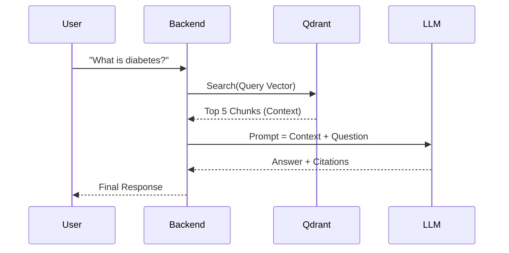

# 🏗️ GenMedX System Architecture

This document provides a comprehensive technical overview of the **GenMedX** AI Healthcare Agent. It details the system's high-level design, component interactions, and the specific workflows for its three core modules.

---

## 1. High-Level Design

GenMedX follows a **Microservices-like Architecture** where the frontend is decoupled from the backend, and specific AI tasks are offloaded to specialized inference services (Hugging Face Spaces, Replicate, OpenAI).

```mermaid
graph TD
    User([User]) <--> Frontend[Streamlit Frontend]
    Frontend <-->|REST API (JSON)| Backend[FastAPI Backend]
    
    subgraph "Core Application"
        Backend --> Router{API Router}
        Router -->|/chat| ChatEngine[Chatbot Engine]
        Router -->|/risk_predict| RiskEngine[Risk Analysis Engine]
        Router -->|/symptom_predict| SymptomEngine[Symptom Diagnosis Engine]
    end
    
    subgraph "Data Layer"
        ChatEngine <-->|Retrieve| Qdrant[Qdrant Vector DB]
        RiskEngine <-->|Retrieve| Qdrant
    end
    
    subgraph "Inference Layer (Cloud)"
        ChatEngine -->|Generate| Replicate[Replicate (Llama 3)]
        RiskEngine -->|Predict| HF_Space1[HF Space: BioMistral Adapter]
        SymptomEngine -->|Classify| HF_Space2[HF Space: Symptom Model]
        SymptomEngine -->|Explain| OpenAI[OpenAI (GPT-4o)]
    end
```

### Technology Stack
*   **Frontend**: Streamlit (Python)
*   **Backend**: FastAPI (Python)
*   **Database**: Qdrant Cloud (Vector Database)
*   **AI Models**:
    *   *Chat*: Llama 3-8B, BioMistral-7B, Gemini 1.5 Pro
    *   *Risk*: BioMistral-7B (Adapter)
    *   *Diagnosis*: BioMistral-7B (Fine-Tuned) + GPT-4o

---

## 2. Module 1: Medical Chatbot (RAG)

**Goal**: Provide accurate, sourced answers to medical questions using Retrieval-Augmented Generation (RAG).

### Workflow
1.  **Query Embedding**: User's question is converted to a vector using `sentence-transformers/all-MiniLM-L6-v2`.
2.  **Retrieval**: The system searches the `medical_knowledge_base` collection in Qdrant for the top 5 most similar Q&A pairs (sourced from MedQA-USMLE).
3.  **Context Construction**: Retrieved text is formatted into a system prompt.
4.  **Generation**: The LLM (e.g., Llama 3) generates an answer based *only* on the provided context.



---

## 3. Module 2: Risk Analysis (Triage)

**Goal**: Predict patient risk (High/Low) and provide clinical reasoning, avoiding hallucinations.

### Workflow ("Verify First" Architecture)
1.  **Input**: User provides Chief Complaint + Vital Signs (HR, BP, Temp, etc.).
2.  **Local RAG**: System searches `triage_cases` in Qdrant for similar historical cases based on the complaint.
3.  **Prompt Injection**: A specialized prompt is constructed locally. It explicitly instructs the model to:
    *   *Step 1*: List the patient's vitals.
    *   *Step 2*: Compare each vital to standard normal ranges.
    *   *Step 3*: Flag abnormalities (e.g., "HR 110 is Tachycardia").
    *   *Step 4*: Determine risk level.
4.  **Inference**: This structured prompt is sent to the **BioMistral Adapter** hosted on Hugging Face Spaces.
5.  **Parsing**: The backend parses the model's HTML output to extract the Risk Level and Reasoning.

```mermaid
graph LR
    A[Patient Vitals] --> B[Prompt Builder]
    C[Similar Cases] --> B
    B -->|Injected Prompt| D[HF Space (BioMistral)]
    D -->|Raw Text| E[Response Parser]
    E -->|JSON| F[Frontend UI]
```

---

## 4. Module 3: Symptom Diagnosis

**Goal**: Diagnose disease from symptoms and explain it in plain English.

### Workflow (Hybrid Pipeline)
This module uses a two-stage approach to combine the precision of a specialized classifier with the communication skills of a large generalist model.

1.  **Classification (Stage 1)**:
    *   **Input**: List of symptoms (e.g., "cough, fever, chest pain").
    *   **Model**: **BioMistral-7B-SymptomDiagnosis** (Fine-Tuned on 10 disease classes).
    *   **Output**: Predicted Disease Label (e.g., "Pneumonia") + Confidence Score.
    
2.  **Explanation (Stage 2)**:
    *   **Input**: Predicted Disease + Original Symptoms.
    *   **Model**: **GPT-4o**.
    *   **Prompt**: "Explain why [Symptoms] suggest [Disease] to a patient. Include pathophysiology and care advice."
    *   **Output**: A structured, empathetic medical explanation.

```mermaid
graph TD
    User[User Symptoms] --> Backend
    Backend -->|Phase 1| Classifier[BioMistral-7B (HF Space)]
    Classifier -->|Label: 'Flu'| Backend
    Backend -->|Phase 2| Explainer[GPT-4o]
    Explainer -->|Explanation| Backend
    Backend -->|Diagnosis Card| User
```

---

## 5. Data Pipeline

The system relies on two primary Qdrant collections:

| Collection Name | Source Data | Purpose | Embedding Model |
| :--- | :--- | :--- | :--- |
| `medical_knowledge_base` | MedQA-USMLE, PubMedQA | Provides medical facts for Chatbot RAG | `all-MiniLM-L6-v2` |
| `triage_cases` | MIMIC-IV (Synthetic Subset) | Provides historical context for Risk Analysis | `all-MiniLM-L6-v2` |

**Note**: Module 3 does not use a vector database; its knowledge is encoded directly into the fine-tuned model weights.
