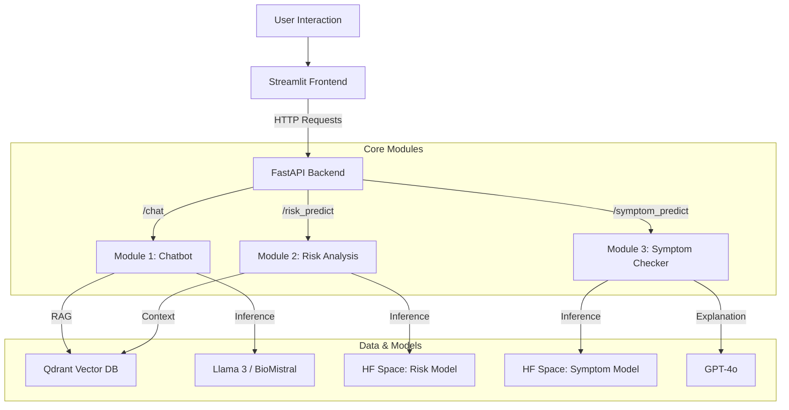

# 🏥 GenMedX: AI Healthcare Agent

**Advanced Medical Q&A Chatbot & Intelligent Risk Analysis System**

Google drive link for project artifacts: https://drive.google.com/drive/folders/18wEXAiZDkaYGKw7IlREjpuk_ZYZfYUxb 

---

## 📋 Executive Summary

**GenMedX** is a comprehensive AI healthcare platform designed to democratize access to medical information and assist in preliminary patient triage. The system integrates **Retrieval-Augmented Generation (RAG)** across two core modules to ensure accuracy, reduce hallucinations, and provide grounded medical reasoning.

**Key Innovations:**
*   **Multi-Model Comparison**: Evaluates 4 state-of-the-art LLMs (Gemini 1.5, Llama 3, BioMistral, Meditron) for medical accuracy.
*   **"Verify First" Risk Engine**: A novel "Prompt Injection" architecture that forces the AI to verify patient vitals against normal ranges before generating a diagnosis.
*   **Hybrid Symptom Checker**: Combines fine-tuned local models with GPT-4o for high-accuracy diagnosis and human-like explanations.
*   **Dual-RAG Pipeline**: Combines local vector search (Qdrant) with cloud-based inference (Hugging Face Spaces & Replicate).

---

## 🏗️ System Architecture

The application is built on a **FastAPI** backend and a **Streamlit** frontend, orchestrated by a central `ModelManager`.

> 📘 **Detailed Documentation**: For a deep dive into the technical design of each module, see [ARCHITECTURE.md](ARCHITECTURE.md).

### High-Level Architecture



### Module 1: Medical Q&A Chatbot
*Goal: Provide accurate, sourced answers to medical questions.*


### Module 2: Risk Analysis & Triage
*Goal: Predict patient risk (High/Low) and provide doctor-like reasoning.*


**The "Prompt Injection" Technique:**
To eliminate hallucinations (e.g., the model inventing a high heart rate), we bypass the standard API inputs and inject a structured **Chain-of-Thought** prompt directly into the model. This forces the AI to:
1.  **Read** the patient's specific vitals.
2.  **Compare** them to normal ranges (e.g., "HR 80 is normal").
3.  **Conclude** the risk level based on verified data.

### Module 3: Symptom Diagnosis & Checker
*Goal: Predict disease from symptoms and provide medical explanation.*

```mermaid
graph LR
    A[User Symptoms] --> B(Backend API)
    B --> C{BioMistral-7B (Fine-Tuned)}
    C -->|Predicted Diagnosis| D[GPT-4o]
    D -->|Generate Explanation| E[Final Output]
    E --> F[Frontend UI]
```

**Hybrid Pipeline:**
*   **Phase 1 (Classification)**: Uses a fine-tuned BioMistral-7B model to classify symptoms into one of 10 common conditions (99.1% accuracy).
*   **Phase 2 (Explanation)**: Uses GPT-4o to generate a clear, patient-friendly explanation of *why* those symptoms led to that diagnosis.

---


## 🚀 Getting Started

### Prerequisites
*   Python 3.10+
*   API Keys: Google AI, Replicate, Qdrant Cloud

### Installation

1.  **Clone the Repository**
    ```bash
    git clone https://github.com/yourusername/GenMedX.git
    cd GenMedX
    ```

2.  **Set Up Environment**
    ```bash
    python -m venv .venv
    source .venv/bin/activate  # Windows: .venv\Scripts\activate
    pip install -r requirements.txt
    ```

3.  **Configure API Keys**
    Create a `.env` file:
    ```env
    GOOGLE_API_KEY=your_key
    REPLICATE_API_TOKEN=your_key
    QDRANT_URL=your_url
    QDRANT_API_KEY=your_key
    ```

4.  **Initialize Data Pipeline**
    ```bash
    python data/1_download_datasets.py
    python data/2_convert_to_qa.py
    python data/3_build_vector_db.py
    ```

### Running the Application

**1. Start the Backend API**
```bash
uvicorn backend.main:app --reload
# API will be live at http://localhost:8000
```

**2. Launch the Frontend UI**
```bash
streamlit run frontend/Home.py
# UI will open at http://localhost:8501
```

---

## 📂 Project Structure

```
AI Healthcare Agent/
├── backend/                 # FastAPI Application
│   ├── main.py             # API Routes
│   └── risk_predictor.py   # Risk Analysis Logic (HF Space Integration)
├── frontend/                # Streamlit UI
│   ├── Home.py             # Landing Page
│   └── pages/              # Chatbot & Risk Analysis Pages
├── modules/                 # Core Logic
│   └── shared/             # Shared Models & Utilities
├── rag/                     # RAG Pipeline
│   └── retriever.py        # Qdrant Vector Search
├── data/                    # Data Engineering Scripts
├── evaluation/              # RAGAS Evaluation Scripts
└── config.py                # Configuration Management
```

---

## ⚠️ Medical Disclaimer

**GenMedX is an educational research project.**
It is **NOT** a medical device and should **NOT** be used for diagnosis or treatment. The "Risk Analysis" feature is a demonstration of AI capabilities and does not replace professional medical judgment. Always consult a qualified healthcare provider for medical advice.

---
